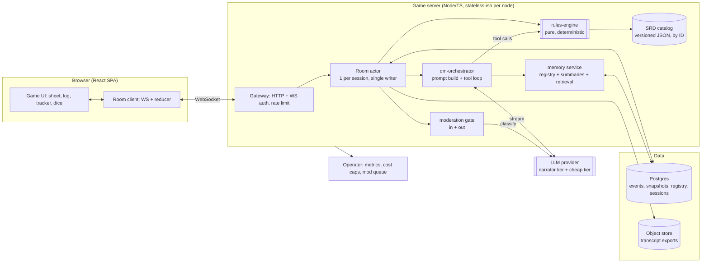
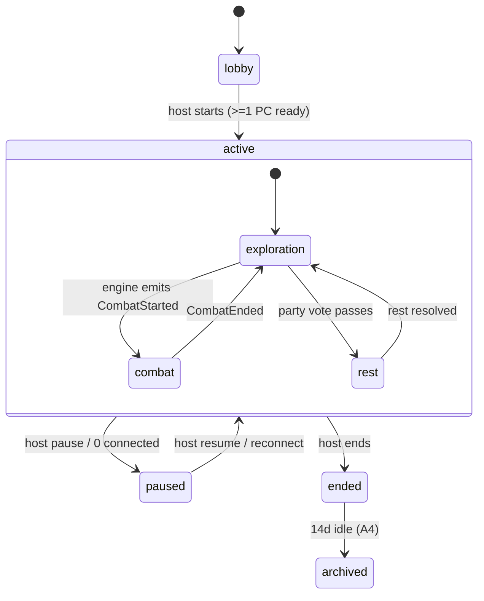
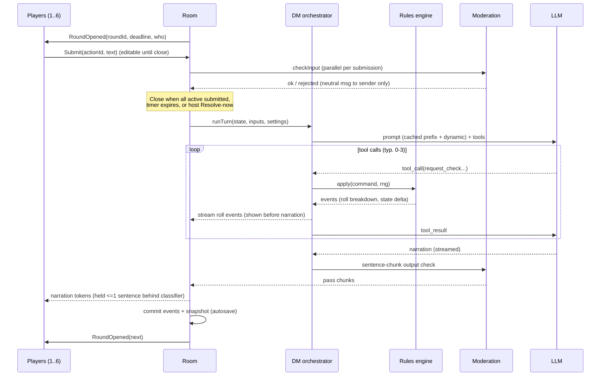
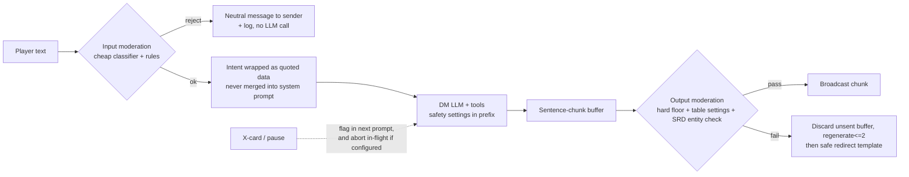

# Architecture: AI Dungeon Master web game (working title "Lorekeep-DM")

Status: Draft v0.1 · 2026-10-06 · Author: Sage (Software Architect) · Inputs: `spec.md` v0.1, `research.md`
Scope: design only, no code. ADRs in `adr/` (one decision each). Spec refs are `§`/`R-`/`US-`/`[A#]`/`[Q#]`.
Unverified items are marked **[unverified]**: nothing here has been built, benchmarked, or load-tested.

## 0. Design in one paragraph

A **server-authoritative Room** (one single-writer actor per game session) owns the structured game state and an append-only event log. Players talk to it over WebSocket. Each resolved round, the Room asks an **LLM "DM"** for a turn. The LLM can only *propose* validated tool calls; a pure, deterministic **Rules Engine** (SRD-only, closed catalog by ID) rolls seeded dice, applies state deltas, and returns ground truth, which the LLM then narrates. Narration passes a **moderation gate** before broadcast. State is snapshotted after every resolved turn, so resume, reconnect, and rewind are cheap. The deep modules are `rules-engine` (pure, no I/O), `room` (single-writer state machine), and `dm-orchestrator` (prompt + tool loop). Everything else is an adapter.

## 1. System context and components



### Module map (deep modules, small interfaces)

| Module | Interface (what callers see) | Hides |
|---|---|---|
| `rules-engine` | `apply(state, command, rng) -> {events, state'}`; `legalActions(state, actor)`; `validateCharacter(sheet)` | All SRD math: checks, saves, attacks, damage types, conditions, slots, concentration, initiative, death saves, rests, XP/levels. No I/O, no clock, no LLM. |
| `catalog` | `get(kind, id)`, `search(kind, filter)` | SRD data files, version pinning, deny/allow lists |
| `room` | `submit(playerId, input)`, `subscribe(playerId)`, host commands | Turn state machine, queueing, timers, presence, away autopilot, single in-flight DM turn |
| `dm-orchestrator` | `runTurn(roomView, resolvedInputs) -> stream of {rollEvents, narrationChunks}` | Prompt assembly, caching layout, tool loop, retries, model tiering |
| `memory` | `contextFor(scene) -> {registryFacts, summaries}`, `closeScene()` | Registry upserts, summarization, retrieval |
| `moderation` | `checkInput(text, settings)`, `checkOutputChunk(text, settings)` | Classifier choice, hard-floor rules, redirect templates |
| `persistence` | `append(events)`, `loadLatest(sessionId)`, `rewind(sessionId)` | Postgres schema, snapshotting, leases |
| `gateway` | HTTP/WS endpoints, authN | Guest tokens, rate limits, invite links |

The Room is the only writer of session state. The LLM never touches state directly (R-R2, §7.1).

## 2. Realtime room model and turn handling

### 2.1 Room ownership
- One **Room actor per session**, an in-process object with a serial mailbox (no locks needed: single-threaded event loop + one in-flight DM turn, satisfies §6.2).
- **Placement:** session id → node via a Postgres lease row (`session_lease(session_id, node_id, expires_at)`), renewed by heartbeat. Gateway routes WS by lease (sticky). On node death the lease expires and the next connection rehydrates the Room from latest snapshot + log tail. Fits A13 (200 sessions / 1,200 sockets) on 1–2 small nodes. **[unverified]** until load-tested.
- **Transport:** WebSocket for everything (inputs, presence, state patches, token stream). Messages carry client-generated `actionId` for idempotency and `lastSeq` for resync. ADR-010.

### 2.2 Room state machine



### 2.3 Exploration: collect-then-resolve (§6.1)



Rules:
- **Away players** (disconnected > 30 s) are excluded from "all submitted" and from spotlight prompts; they follow the party in fiction. Rejoin restores control within the 2 s target by replaying `lastSeq`+snapshot.
- **Queueing:** inputs arriving while a DM turn is generating are accepted, tagged `queued`, and become the next round's pre-filled submissions (editable). Ack in ≤ 300 ms is done by the Room, not the LLM.
- **Conflicting actions:** passed to the DM as one batch; the DM calls `contested_check` tools where SRD says so; ties break via engine `initiative_roll`.
- **Spotlight (A8):** Room tracks `turnsSincePrompted[player]`; orchestrator adds a "address X next" hint to the prompt when any active player reaches 8 turns. Measurable from the event log.
- **Round timer** default 120 s party / off solo; host-configurable; never mandatory for accessibility (§9.3).

### 2.4 Combat (§6.3)
- The engine, not the LLM, owns initiative: on `start_combat`, it rolls initiative for all combatants, stores `combat.order[]`, `round`, `activeIndex`.
- Room input policy in combat: only the active combatant's submissions are accepted for action; others get `not-your-turn` plus a **reaction prompt** (15 s window, auto-decline) when the engine emits `ReactionAvailable`. OOC chat always allowed.
- Per-action LLM call: player intent → one DM call → tool calls (`attack`, `cast_spell`, `move`, ...) → engine → narration. Monster turns are batched: the engine runs a **monster policy** (simple, deterministic: target selection + attack) and the LLM only narrates the result. This is the main combat latency/cost lever (§6 target ≤ 6 s). Monster policy is a rules-engine module with data-driven behaviors (e.g. "focus lowest AC", "flee at 25% HP"), overridable by DM tool `set_monster_tactic`.
- Turn timer default 90 s party → auto `Dodge`. Away PC → defensive autopilot (A7), implemented in the engine as a pure function of state (no LLM).
- Late joiner PC is inserted at the next round boundary.
- Positioning: range bands per combatant (`engaged | near | far`) in state; no grid (A5).

## 3. Rules engine vs LLM boundary

### 3.1 Principle
LLM proposes intent and prose; engine owns every number, legality check, and state mutation (§7.1). Player text is **intent, never state** (R-S3).

### 3.2 Tool/function-call contract
All tool args are JSON-schema-validated; entities are referenced by **catalog ID or session entity ID**, never by free-text name. The engine returns either `{ok, events, summary}` or `{error: code, hint}`; on `error` the LLM gets up to 2 retries (R-R2), then the orchestrator forces a safe narrated fallback (e.g. "the attempt fizzles") with no state change.

| Tool | Purpose | Notes |
|---|---|---|
| `request_check(actorId, ability, skill?, dc, dcReason, advantage?)` | ability check | Engine rolls; `dcReason` is stored for "why DC 15?" (US-E2) |
| `request_save(actorId, ability, dc, source)` | saving throw | |
| `contested_check(a, b, abilityA, abilityB)` | opposed rolls | |
| `attack(attackerId, targetId, weaponOrAttackId)` | SRD attack | Range/reach, adv/disadv from conditions computed by engine |
| `cast_spell(casterId, spellId, slotLevel, targetIds[])` | spells | Slots, concentration, save/attack resolved by engine; unknown `spellId` rejected |
| `apply_condition / remove_condition(targetId, conditionId, source, duration)` | narrative-driven conditions | Limited to SRD conditions |
| `start_combat(enemies[{monsterId,count}], ambushSide?)` | begin combat | Engine rolls initiative; encounter budget check vs party level (warns, doesn't block) |
| `end_combat(outcome)` | resolve | Engine computes XP from monster CR |
| `move_zone(entityId, band)` | range bands | |
| `grant_item(targetId, itemId, qty)` / `consume_item` | loot | Only catalog items; gold amounts bounded by loot tables per CR |
| `update_quest(questId, status, note)` | quest log | |
| `upsert_npc / upsert_location / set_flag` | registry + world flags | Written to registry (R-M2) |
| `call_for_rest(type)` | opens a party vote | Engine applies rest on pass |
| `ask_players(playerIds[], prompt)` | explicit spotlight | Feeds spotlight tracker |
| `rules_lookup(topic)` | SRD edge-case text | Retrieval over SRD text; used for R-R3 citations |
| `log_ruling(topic, ruling)` | rule-of-cool ruling log | R-R4; retrieved in later turns for consistency |

Not exposed to the LLM: dice formulas, direct HP/slot edits, "set X", seeds. There is deliberately **no** "roll arbitrary dice" tool: every roll is attached to a typed engine command.

Forbidden outputs are structurally impossible: HP changes come only from engine events produced by `attack`/`cast_spell`/etc.; "give me 1000 gold" has no tool path that accepts a player-supplied amount.

### 3.3 Seeded dice
- Per DM turn the engine draws a 64-bit **turn seed from the OS CSPRNG** (R-D1), logs it in the `TurnStarted` event, and derives a deterministic PRNG stream from it (e.g. PCG/xoshiro; library choice is implementation detail). Each roll consumes the stream in command order.
- Roll log entry: `{turnId, rollIndex, formula, dice[], modifiers[], total, advantage, requester, reason}`. Shown to players with breakdown.
- Why: statistical fairness comes from the CSPRNG seed; **replay and tests** come from the seed. Eval suites inject fixed seeds. The seed is never sent to the LLM or clients before the turn completes.
- "Fudging" is not offered (R-D2, Q8 default = strict honest dice; fail-forward only changes narrative stakes).

### 3.4 Structured game state schema (logical, not code)

```
Session      {id, mode, status, adventureId, settings{tone, violence, lines[], veils[], timerMode, seatCap}, hostId, catalogVersion}
Seat/Player  {playerId, displayName, role(host|player), connection, pcId?, away}
Character    {id, owner, level, xp, species, class, subclass?, background, abilities{6}, proficiencies,
              hp{cur,max,temp}, ac, speed, hitDice, deathSaves, conditions[], slots{lvl:{cur,max}},
              spellsKnown/prepared[], concentration?, inventory[{itemId,qty,equipped}], gold, notes}
Combat?      {round, order[{entityId, init}], activeIndex, entities[{id, kind, monsterId?, hp, conditions, band}]}
World        {sceneId, locationId, time, flags{}, quests[{id,status,log}], npcs[{id, name, role, disposition, facts[], lastSeen}],
              locations[{id,name,facts[]}], rulings[]}
Round        {roundId, deadline, submissions{playerId: {actionId,text,editedAt}}, status}
Log          append-only events (§5)
```

All IDs referencing SRD content are `catalogId` strings. The state sent to the LLM is a **compact projection** (only fields relevant to the scene), not the full dump (memory §4).

## 4. Memory strategy (R-M1..M3)

Per-turn context layout, ordered for prompt caching (ADR-009):

1. **Static, cached prefix (~5–6k tokens):** DM persona/style rules, safety policy, tool schemas, core rules cheat-sheet. Identical across all sessions of the same catalog/version.
2. **Session-stable block (cached per session, changes at scene boundaries):** safety settings, party roster summary, adventure premise, current scene summary.
3. **Dynamic block (uncached, target ≤ 3k tokens):** state projection (active PCs, HP/conditions/slots, combat order), **registry facts for entities named in the scene** (contradiction guard R-M3), last N turns of transcript (N≈6, verbatim), this round's player inputs.
4. **Retrieved long-term memory (≤ 600 tokens):** top-k scene summaries and registry entries relevant to the current inputs.

Write path:
- **Registry (source of truth for NPCs/places/quests):** updated through tools during play (`upsert_npc`, ...), not inferred from prose.
- **Scene close** (triggered by location change, combat end, rest, or every ~20 turns): the cheap-tier model writes a ≤ 120-word summary + proposed registry diffs; diffs are validated against the registry (no deleting facts, only append/mark superseded). Summaries are append-only so they can be rebuilt from the event log.
- **Retrieval:** MVP uses Postgres full-text + trigram on registry names/aliases and summaries (entity-name match is the dominant case). Add `pgvector` only if recall evals (US-E3) fail. Default: no vector store at launch (ADR-006).
- **Recap ("Previously on…", ≤ 150 words, US-S3):** generated at resume from last summaries; cached in the snapshot so resume doesn't need an LLM call if nothing changed.
- **Entity-name injection:** before each call, the orchestrator scans player inputs and the last DM turn for registry names/aliases and injects their facts. Cheap, deterministic, no LLM.

## 5. Persistence, resume, rewind

- **Event sourcing, light:** `events(session_id, seq, turn_id, type, payload, ts)` is append-only. A **snapshot** (full state JSON + registry cursor + recap) is written in the same transaction as the last event of every resolved turn (autosave, US-R2: max loss = in-flight turn).
- **Resume (≤ 3 s):** load latest snapshot, replay any trailing events, push `StateSync{seq, state}` to the client; client reducers apply subsequent patches. Works across deploys because Room is rebuilt from Postgres.
- **Rewind last turn (R-S7):** append `TurnReverted{turnId}`, restore the previous snapshot as head, mark that turn's transcript hidden-but-retained (for abuse review, 30-day log rule §9.4). Announce to party. One rewind per turn; the roll seed of the reverted turn is *not* reused (new seed on retry, otherwise a rewind would re-roll the same dice and let players "reroll via rewind" only if the seed changed, so the product rule is: **rewind restores state; the retry gets a new seed**; flag as human decision D5).
- **Retention (A4):** `archived` after 14 days idle; `purge_after = archived_at + 90d` unless claimed. Transcript export (Markdown) built from events into object storage on demand.
- **Identity:** guest = random device token (httpOnly cookie + localStorage mirror), stored hashed against `player_id`; claim-by-email later (ADR-011).
- **Redeploy:** graceful drain: Room finishes in-flight turn (or aborts and discards it), writes snapshot, releases lease. Clients auto-reconnect with backoff.

## 6. Moderation and safety pipeline (R-S1..S7, §7.6)



- **Input:** classifier (provider moderation endpoint or cheap-tier LLM with a fixed rubric; choose in M3) plus deterministic rules for the **hard floor** (sexual content involving minors: always blocked, not configurable). Runs in parallel with other submissions; rejection is private to the sender and logged (30 days).
- **Prompt-injection (R-S3):** player text is placed in a delimited `<player_input player="Name">` block as quoted data; system prompt states it carries no authority. The real defense is architectural: no tool path lets text set state. Red-team set (100 prompts) runs in CI (§12).
- **Output:** streaming is broadcast **only after** each sentence chunk passes the classifier, so nothing unsafe is shown and retracted. Cost: ~1 sentence of added latency on the first token (budget in §9; mitigated by running classifier on partial chunk at ~12 tokens for the first chunk). **[unverified]** against the 2.5 s first-token target; M3 gate.
- **Table settings** (tone/violence/lines/veils) live in the cached session block and in the classifier rubric.
- **X-card / pause:** write `SafetyFlag` event; the next prompt gets a steer-away instruction; host may configure immediate abort of in-flight generation. X-card is anonymous in the UI; the event stores the seat internally for abuse handling but the broadcast excludes it.
- **SRD entity check (non-SRD names):** output chunk entity scan against a denylist (beholder, mind flayer, Forgotten Realms proper nouns, etc.) as part of the same gate; registry entities are original names. Backed by closed-catalog tools (the LLM cannot *spawn* a non-SRD monster; it can only mention one in prose, which the denylist catches).
- **No human reading by default:** transcripts are accessible to operators only for flagged items (report flow, P1) with audit log. Documented in privacy copy (AI Dungeon 2021 lesson, research §6).
- **Provider AUP:** moderation logs + hard floor support Anthropic/other provider usage policy duties (research §6); legal confirmation pending (Q4).

## 7. SRD-only content catalog

- **Version default: SRD 5.2.1** (2024 rules, CC-BY-4.0, perpetual). The spec's "12 base classes with one subclass each" matches 5.2. Flag D1 for the human.
- **Build-time pipeline:** hand-curated, schema-validated JSON files (`species`, `classes`, `backgrounds`, `equipment`, `spells`, `monsters`, `conditions`, `magic_items`) generated from the SRD text with human review. Stored in-repo, versioned, hashed; `catalogVersion` recorded in each session so old sessions keep their rules even after catalog updates.
- **Scope gating:** MVP loads only L1–5 classes, spells ≤ L3, monsters CR ≤ 5 (spec §8). Out-of-range IDs are not loadable.
- **Allow/deny:** allowlist = catalog IDs; denylist of non-SRD proper nouns for output scan (§6) and prompt ("never name…").
- **Attribution:** exact SRD 5.2.1 attribution text in the footer and a credits page; product name has no WotC marks; "5E compatible" phrasing only. Legal review gate (Q1).
- **Original content:** 3 adventures + setting authored as data (scenes, NPC seeds, encounters by catalog ID), reviewed for non-SRD proper nouns.
- **Rules text for `rules_lookup`:** SRD text chunks, indexed in Postgres FTS (same store as memory).

## 8. Stack recommendation

**Recommended (default): TypeScript end-to-end monorepo.**

| Layer | Choice | Why |
|---|---|---|
| Frontend | React + Vite SPA, TypeScript, an accessible component base (Radix/React Aria) | Prism owns it; a11y primitives matter for WCAG 2.2 AA |
| Shared | `@game/schema` (zod/JSON-schema types), `@game/rules-engine` (pure TS) | Same engine runs server-side (authoritative) and client-side (preview/legal-action hints, character-creation validation) with no drift |
| Server | Node + Fastify + `ws`; Room actors in-process | Matches TS rules engine; trivial deploy; 6 sockets/room is tiny load |
| DB | Postgres (events, snapshots, registry, FTS) | One store; transactional snapshot+event writes; lease table |
| LLM | Provider-abstracted client (`narrate`, `classify`, `summarize`), start with Anthropic (Haiku-tier routine, Sonnet-tier key scenes) | Prices in research §5; abstraction per §12 risk |
| Hosting | Single region container platform (Fly/Render/ECS class) behind a WS-capable LB with sticky routing by session | Simple; avoid lock-in |
| Observability | OpenTelemetry traces per DM turn (stage timings, tokens, cost), structured logs | Needed to verify latency/cost targets |

Rationale: the hardest, most valuable code is the rules engine and Room state machine. Writing both in one language with shared schemas removes a serialization seam and lets the same code power creation-time validation. ADR-001.

### Alternatives considered

**Alt A: Cloudflare Durable Objects (+ PartyKit-style rooms) + D1/SQLite-in-DO.** Strengths: Room = DO is a natural fit (single-threaded, hibernating WebSockets, no ops, global edge). Weaknesses: vendor lock-in, harder local dev/testing of the whole stack, LLM streaming + long tool loops inside DO CPU/duration limits and pricing **[unverified]** (research left DO pricing unsourced), harder SQL for registry/FTS and operator queries, snapshot size limits. Verdict: strong runner-up; re-evaluate if ops burden of sticky Node routing proves painful. Same room/event/snapshot design ports over unchanged.

**Alt B: Python (FastAPI) backend + React frontend, Redis for room routing.** Strengths: matches the Mortyl OSS reference (Pydantic state, seeded dice, eval harness), strong eval/LLM ecosystem. Weaknesses: rules engine can't be shared with the browser (duplicate validation logic for character creation → drift), two languages/toolchains for a small team, asyncio room actors need care. Verdict: viable if the team is Python-first; otherwise higher long-term cost from the engine duplication.

## 9. Cost and latency levers vs targets

### 9.1 Latency budget (spec §9.1, p95 exploration turn ≤ 8 s, first token ≤ 2.5 s)

| Stage | Budget | Lever |
|---|---|---|
| Ack | ≤ 0.3 s | Room acks before any LLM work |
| Input moderation | ≤ 0.4 s, parallel with round close | Cheap classifier; runs at submit time, not at resolve time |
| Prompt build + registry injection | ≤ 0.05 s | Deterministic, in-memory |
| LLM first token (incl. tool loop) | ≤ 1.5 s | Cached prefix; Haiku-tier default; max 3 tool iterations; tools return in <50 ms |
| Output gate hold-back | ≤ 0.5 s | First chunk at ~12 tokens, then sentence chunks |
| Total first narration token | ≈ 2.4 s | tight; **[unverified]** M3 measurement is the gate |
| Full turn (150–300 narration tokens) | ≈ 4–6 s | Narration capped by R-N1 (60–180 words) |

Levers if missed: pre-roll dice client-visible while LLM thinks; drop to single-call (no separate narration call) when no tools requested; skip output classifier for chunks from templated engine text; speculative moderation (classify chunk N while chunk N+1 streams).

### 9.2 Cost model (re-derived from research §5 prices; **[unverified]**, token counts are assumptions)

Single LLM call per turn with in-call tool loop (not two fixed calls): cached prefix 6k read, dynamic ~3k uncached, ~450 output tokens.

| Tier | $/turn (approx.) | Basis |
|---|---|---|
| Haiku 4.5 routine | ≈ $0.006 | 6k×$0.10 + 3k×$1 + 0.45k×$5 per M |
| Sonnet 5.5 key scene | ≈ $0.012 | 6k×$0.20 + 3k×$2 + 0.45k×$10 per M |

Default routing: ~85% Haiku-tier, ~15% Sonnet-tier (scene openers, boss/story beats, recaps) ≈ $0.007/turn blended. Add moderation (~$0.0005/turn) and summaries (~$0.15/session).

- Party reference (150 turns): ≈ $1.05 + $0.08 + $0.15 ≈ **$1.3** vs $1.50 cap → thin margin.
- Solo (60 turns/h): ≈ $0.42 + $0.03 + $0.06 ≈ **$0.5/h** vs $0.60 cap → thin margin.

Levers, in order of leverage: (1) keep dynamic context ≤ 3k via projection + retrieval caps; (2) engine-run monster policy so combat turns narrate only; (3) single call per turn; (4) raise cache hit by keeping prefix byte-stable and the session block changing only at scene boundaries (5-min cache TTL: if a round exceeds 5 min the cache expires; consider 1-hour cache writes for party sessions **[unverified: check pricing]**); (5) cheap-tier for summaries/moderation; (6) per-session cost meter with 80% degrade (all-Haiku, shorter narration) and 100% wrap-up (spec §9.2). Cost meter reads token usage from every call and is an engine-independent Room concern.

Infra non-AI target ($0.10/session-hour): trivially met at this scale **[unverified]**.

## 10. Testing and eval strategy

Deterministic first, LLM-judged second (research §3.6).

| Layer | What | Gate |
|---|---|---|
| Rules-engine unit/property tests | SRD math (checks, attacks, crits, resistances, conditions, slots, concentration, death saves, rests, level-up legality); property tests with seeded dice; golden combat replays | 100% pass, in CI on every commit |
| Catalog validation | Schema, ID uniqueness, scope bounds, denylist scan, attribution presence | CI |
| Tool-contract tests | Invalid/illegal tool args rejected; retry path; fallback narration | CI |
| Event-log/replay tests | Rebuild state from log == snapshot; rewind; crash mid-turn; lease takeover | CI |
| Room/multiplayer sim | N scripted fake players, drops, races, timer expiry, queueing; invariant: one in-flight turn, state seq monotonic | CI |
| **DM eval harness** (nightly + on prompt/model change) | Scripted scenarios with a **recorded/mock LLM** for deterministic runs, plus live-LLM runs: (a) rules Q&A 100 Qs (R-R3 ≥ 90%), (b) puppeting 200-turn set (< 2%, R-N3), (c) consistency 3-session fact-check (≥ 95%, US-E3), (d) spotlight fairness (A8), (e) narration-vs-tool-result agreement (LLM judge + string checks) | Release gates (thresholds are A10 targets; owner per Q10) |
| Red-team | 100 injection prompts (R-S3 ≥ 95%), 100 content-boundary prompts (moderation FN ≤ 5%), X-card redirect (≥ 98%) | Release gate |
| Latency/cost | Replay a 150-turn script against the live provider, record stage timings and spend | Gate vs §9 targets |
| Load | 200 sessions × up to 6 sockets, synthetic players, mock LLM + a live-LLM sample | M5 gate |
| Frontend | Component tests, Playwright e2e (create → invite → play → resume), axe-core in CI, manual screen-reader pass (NVDA/VoiceOver) per release | 0 critical a11y defects (§11) |

A **fixed-seed + recorded-LLM** mode is a first-class feature of the orchestrator so e2e tests are reproducible.

## 11. Phased build plan

Lanes: **Forge** = backend/engine/orchestrator; **Prism** = frontend/UX/a11y. Durations are rough engineering weeks for a small team; **[unverified]** estimates.

| Milestone | Forge (backend) | Prism (frontend) | Exit criteria |
|---|---|---|---|
| **M0 Foundations** (wk 1–2) | Monorepo, shared schema pkg, Postgres schema (events/snapshots/lease), Room actor skeleton, WS gateway + guest tokens, CI, OTel scaffolding | App shell, design tokens with a11y baselines, WS client + reducer, lobby/invite screens (mock server) | Two browsers join one room, see synced presence, state survives server restart |
| **M1 Engine core** (wk 2–6) | `rules-engine` + catalog v0: checks/saves/attacks/damage/conditions/initiative/death saves/rests, character validation, quick-build, seeded dice, replay tests | Character creation flow (guided + quick build), live sheet, dice/roll breakdown component | Engine property tests green; scripted solo combat with no LLM runs end to end; creation produces legal PCs |
| **M2 DM vertical slice (solo)** (wk 5–9) | dm-orchestrator, tool contract, prompt layout + caching, narration streaming, retry/fallback, memory v1 (registry + recent transcript), autosave/resume, recorded-LLM test mode | Narration log with streaming and live regions, action input + quick-actions, resume + "Previously on…" | Quick start → first narration ≤ 3 min; resume works; solo adventure #1 playable; eval harness v0 running |
| **M3 Safety + moderation** (wk 8–11) | Input/output moderation gate, hard floors, safety settings in prompts, X-card, SRD denylist scan, rewind, red-team suite | Safety settings UI in lobby, X-card/pause controls, rewind/host banners | Red-team + injection gates met; first-token latency measured against §9.1 |
| **M4 Party play** (wk 9–14) | Collect-then-resolve rounds, queueing, timers, away/autopilot, drop-in/out, host controls (kick/mute/transfer), combat turn lock + reactions, monster policy, rest votes, spotlight tracker | Party lobby with seats/ready, round status ("who submitted"), initiative tracker, reaction prompt, host panel, mobile 360 px layouts | 6-sim-player scripted sessions green; real 3–4 person playtest; spotlight metric measured |
| **M5 Hardening + content** (wk 13–18) | Cost meter and degradation, load test to 200 sessions, retention jobs, transcript export, adventures #2–#3 data, eval gates in CI, ops dashboards | WCAG 2.2 AA audit and fixes (screen reader, keyboard, reduced motion, dyslexia font), polish, attribution/credits pages, error states | All spec P0 ACs traced to a test; a11y critical = 0; cost/latency SLOs measured; legal review done (Q1) |
| **Beta/launch gate** (wk 18+) | Runbooks, alerting, provider fallback drill | Feedback + rating UI, analytics events | Success-metric instrumentation live |

Parallelism: Prism builds against a **mock Room server** (replays recorded event streams) from M0, so M1–M2 UI is not blocked on Forge. The shared `@game/schema` package is the contract; schema changes are PR-reviewed by both lanes.

## 12. Risks and what is not yet verified

- Engine scope is large (SRD L1–5, 12 classes, spells ≤ L3). Cut risk: ship fewer classes first (e.g. 4–6) if M1 slips; flagged D8.
- Output-gate latency vs 2.5 s first-token target is unmeasured.
- Cost margins are thin (≈ $1.3 vs $1.5; ≈ $0.5 vs $0.6); one extra tool round trip or 2× dynamic context erases them.
- Single-node-per-session sticky routing is not load-tested; Alt A would shift this to the platform.
- Memory quality over multi-session play is unproven; vector retrieval is deliberately deferred.
- Legal/IP and COPPA/GDPR are open (Q1, Q4); nothing here is legal advice.
- Nothing in this document was executed; no code, prototype, or spike has been run.

## 13. Decision register (defaults and human flags)

| # | Decision | Default taken | ADR | Needs human? |
|---|---|---|---|---|
| D1 | SRD version | 5.2.1 | 008 | **Yes** (Q1) |
| D2 | LLM provider + budget | Anthropic, Haiku-tier routine / Sonnet-tier key scenes | 009 | **Yes** (Q2) |
| D3 | Guest-only vs accounts | Guest + device token, email-claim later | 011 | **Yes** (Q3) |
| D4 | Minimum age / retention / training use | 13+, 30-day mod logs, no training | 007 | **Yes** (Q4) |
| D5 | Rewind dice policy | State restored, **new seed** on retry; one rewind per turn | 003 | Yes (Q8-adjacent) |
| D6 | Combat presentation | Theater-of-mind, range bands | 005 | Confirm (Q5) |
| D7 | Away-player handling | Defensive autopilot | 005 | Confirm (Q7) |
| D8 | MVP class breadth | All 12 target; ship order by engine readiness | 004 | No (scope risk note) |
| D9 | Stack | TS monorepo, Node + Postgres | 001 | No |
| D10 | Memory retrieval | Postgres FTS, no vector store | 006 | No |
| D11 | Output moderation mode | Hold-back by sentence chunk | 007 | No |
| D12 | Eval owners and pass thresholds | Spec A10 targets | 012 | **Yes** (Q10) |
