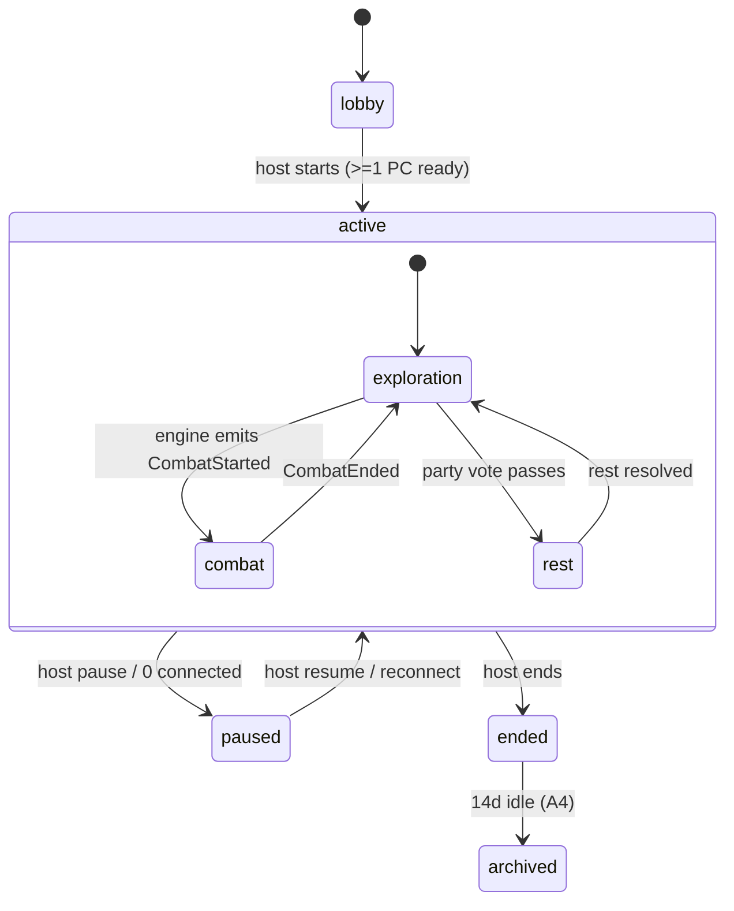
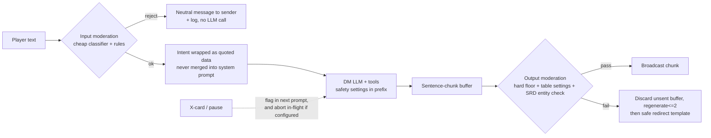
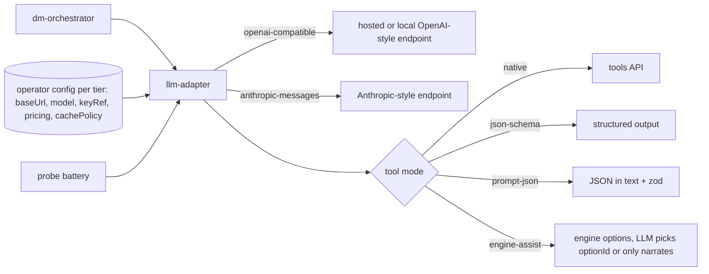

# Architecture: AI Dungeon Master web game (working title "Lorekeep-DM")

Status: Draft v0.4 · 2026-10-06 · Author: Sage (Software Architect) · Inputs: `spec.md` v0.1, `research.md`, `reuse-audit.md`, human decisions of 2026-10-06 (rounds 1-3; newest round is authoritative)
Scope: design only, no code. ADRs in `adr/` (one decision each). Spec refs are `§`/`R-`/`US-`/`[A#]`/`[Q#]`.
Unverified items are marked **[unverified]**: nothing here has been built, benchmarked, or load-tested.

## Changes since v0.1

Human decisions applied (all authoritative): SRD 5.2.1 confirmed; configurable LLM endpoint; accounts required; round 2 (2026-10-06) overrides parts of v0.2: **18+ minimum with age attestation**, mature content (superseded by round 3), 2D top-down map first with 3D later, legal/compliance items deferred to a parking lot; 30-day log retention; configurable LLM endpoint.

| # | Change | Where | ADR |
|---|---|---|---|
| 1 | SRD 5.2.1 confirmed (D1 closed; legal review still open) | §7 | 008 (Accepted) |
| 2 | LLM provider is an operator-configured adapter per tier (`fast`/`frontier`): OpenAI-compatible and Anthropic-style dialects, local models; tool-call capability probe and four fallback modes; **prompt caching is optional** | §8, §9, §16 | 013, 009 (revised) |
| 3 | **Guest identity removed.** Accounts required (email+password, argon2id, server-side sessions); export and deletion; Room actor model unchanged, identity is `accountId` | §1, §5, §14 | 014; 011 Superseded |
| 4 | **v0.3/v0.4:** minimum age 18+, age attestation by **birthdate entry** at registration (round 3; 18+ computed server-side; store only adult flag + check date, DOB discarded: **human to confirm**); under-18 refused. Parental consent and a 13-17 audience are a later-roadmap extension point only: no consent flows, guardian entities, `pending_consent` state, or minors' restrictions in MVP | §14 | 015 (retitled) |
| 5 | **v0.4 (round 3):** content tiers `family/standard/mature`; **mature is the default, off only if any seated player opts out** (live, re-evaluated each round open and before each narration; carries over on host transfer); not explicit; per-player lines/veils/pause kept; hard floor unchanged; `endpoint_allows_mature` degrade path | §6, §14.3 | 016, 007 (amended) |
| 6 | 30-day log retention, nightly deletion jobs, account-deletion pipeline | §5, §14 | 017 |
| 7 | **Combat is a tactical grid map.** Range bands and theater-of-mind removed. Rules-engine-owned map model, 2D canvas renderer, accessibility alternatives, map sources, later 3D and STL/GLB import | §2.4, §3, §15 | 018-021; 005 (amended) |
| 8 | Cost and latency re-derived **without** caching; the $1.50/$0.60 figures are operator-configurable budgets, not product requirements (reference estimate about $1.8-2.2 per party session) | §9 | 009 |
| 9 | New event types, schema fields, tools | §3, §5 | 018 |
| 10 | **Build plan: about 23 weeks**, full scope kept (round 3: no scope cuts; §11.1 cut list declined by human, reference only) | §11 | |
| 11 | **v0.3:** legal/compliance items (upload IP, upload moderation, privacy-law specifics, trademark) parked in §17, not milestone gates; SRD CC-BY attribution stays an MVP requirement | §7, §17 | 008, 020, 021 |
| 12 | **v0.3:** 3D/isometric view and STL/GLB import is a later-phase sketch only (ADR-021), no milestone work | §15 | 021 |

Spec text that now conflicts and needs Compass to amend (not edited here): US-S1 AC2, US-P2 AC1 and A3 (guest play); §4.4, A5, §10 MVP row and the non-goal "battle-map VTT" (combat is map-based; fog of war stays out); R-S5 and §9.5 (age floor 18+, retention); US-X1 tone options (mature gating); Q3, Q4, Q5 (now decided). `process.md` cites "architecture.md section 8" for milestones; the build plan is §11.

## 0. Design in one paragraph

A **server-authoritative Room** (one single-writer actor per game session) owns the structured game state, including the tactical map, and an append-only event log. Authenticated players (accounts, ADR-014) talk to it over WebSocket. Each resolved round, the Room asks an **LLM "DM"** for a turn. The LLM can only *propose* validated tool calls; a pure, deterministic **Rules Engine** (SRD-only, closed catalog by ID; owns grid positions, movement, line of sight, cover, and areas) rolls seeded dice, applies state deltas, and returns ground truth, which the LLM then narrates. Narration passes a **moderation gate** before broadcast. State is snapshotted after every resolved turn, so resume, reconnect, and rewind are cheap. The deep modules are `rules-engine` (pure, no I/O), `room` (single-writer state machine), and `dm-orchestrator` (prompt + tool loop over a configurable LLM adapter). Everything else is an adapter.

## 1. System context and components

```mermaid
flowchart LR
  subgraph Browser["Browser (React SPA)"]
    UI[Game UI: sheet, log, tracker, dice]
    WSC[Room client: WS + reducer]
  end
  subgraph Server["Game server (Node/TS, stateless-ish per node)"]
    GW[Gateway: HTTP + WS auth, accounts, rate limit]
    ROOM[Room actor<br/>1 per session, single writer]
    RULES[[rules-engine<br/>pure, deterministic]]
    DMO[dm-orchestrator<br/>prompt build + tool loop]
    MOD[moderation gate<br/>in + out]
    MEM[memory service<br/>registry + summaries + retrieval]
    CAT[(SRD catalog<br/>versioned JSON, by ID)]
  end
  subgraph Data["Data"]
    PG[(Postgres<br/>events, snapshots, registry, accounts, sessions)]
    OBJ[(Object store<br/>exports, later: map/asset uploads)]
  end
  LLM[[LLM endpoints (operator-configured)<br/>frontier tier + fast tier, via adapter]]
  OPS[Operator: metrics, cost caps, mod queue, retention jobs]

  UI <--> WSC <-->|WebSocket| GW
  GW --> ROOM
  ROOM --> RULES
  RULES --> CAT
  ROOM --> DMO
  DMO -->|tool calls| RULES
  DMO --> MEM
  DMO <-->|stream| LLM
  ROOM --> MOD
  MOD -->|classify| LLM
  ROOM <--> PG
  MEM <--> PG
  ROOM --> OBJ
  Server --> OPS
```

### Module map (deep modules, small interfaces)

| Module | Interface (what callers see) | Hides |
|---|---|---|
| `rules-engine` | `apply(state, command, rng) -> {events, state'}`; `legalActions(state, actor)`; `validateCharacter(sheet)`; map queries `reachable/path/distance/hasLineOfSight/coverBetween/areaCells`; `describe(state, viewer)` | All SRD math: checks, saves, attacks, damage types, conditions, slots, concentration, initiative, death saves, rests, XP/levels, **and the tactical map** (positions, movement cost, opportunity attacks, cover, areas of effect). No I/O, no clock, no LLM. |
| `catalog` | `get(kind, id)`, `search(kind, filter)` | SRD data files, version pinning, deny/allow lists |
| `room` | `submit(playerId, input)`, `subscribe(playerId)`, host commands | Turn state machine, queueing, timers, presence, away autopilot, single in-flight DM turn |
| `dm-orchestrator` | `runTurn(roomView, resolvedInputs) -> stream of {rollEvents, narrationChunks}` | Prompt assembly, optional-caching layout, tool loop, retries, model tiering, tool-mode fallback |
| `llm-adapter` | `capabilities()`, `complete(req) -> stream`, `probe()` | Dialects (OpenAI-compatible, Anthropic-style), keys, pricing, per-endpoint quirks (ADR-013) |
| `identity` | `signup/login/logout`, `export`, `delete` | Password hashing, sessions, age attestation (ADR-014/015) |
| `retention` | nightly sweeper | Deletion jobs, redaction (ADR-017) |
| `memory` | `contextFor(scene) -> {registryFacts, summaries}`, `closeScene()` | Registry upserts, summarization, retrieval |
| `moderation` | `checkInput(text, settings)`, `checkOutputChunk(text, settings)`, `tableTier(session, seatedPlayers)` | Classifier choice, hard-floor rules, content tiers, redirect templates |
| `persistence` | `append(events)`, `loadLatest(sessionId)`, `rewind(sessionId)` | Postgres schema, snapshotting, leases |
| `gateway` | HTTP/WS endpoints, authN | Session cookies, WS tickets, rate limits, invite links |

The Room is the only writer of session state. The LLM never touches state directly (R-R2, §7.1).

## 2. Realtime room model and turn handling

### 2.1 Room ownership
- One **Room actor per session**, an in-process object with a serial mailbox (no locks needed: single-threaded event loop + one in-flight DM turn, satisfies §6.2).
- **Placement:** session id → node via a Postgres lease row (`session_lease(session_id, node_id, expires_at)`), renewed by heartbeat. Gateway routes WS by lease (sticky). On node death the lease expires and the next connection rehydrates the Room from latest snapshot + log tail. Fits A13 (200 sessions / 1,200 sockets) on 1–2 small nodes. **[unverified]** until load-tested.
- **Transport:** WebSocket for everything (inputs, presence, state patches, token stream). Authenticated by a one-time WS ticket from the account session (ADR-014). Messages carry client-generated `actionId` for idempotency and `lastSeq` for resync. ADR-010.

### 2.2 Room state machine



### 2.3 Exploration: collect-then-resolve (§6.1)


Rules:
- **Away players** (disconnected > 30 s) are excluded from "all submitted" and from spotlight prompts; they follow the party in fiction. Rejoin restores control within the 2 s target by replaying `lastSeq`+snapshot.
- **Queueing:** inputs arriving while a DM turn is generating are accepted, tagged `queued`, and become the next round's pre-filled submissions (editable). Ack in ≤ 300 ms is done by the Room, not the LLM.
- **Conflicting actions:** passed to the DM as one batch; the DM calls `contested_check` tools where SRD says so; ties break via engine `initiative_roll`.
- **Spotlight (A8):** Room tracks `turnsSincePrompted[player]`; orchestrator adds a "address X next" hint to the prompt when any active player reaches 8 turns. Measurable from the event log.
- **Round timer** default 120 s party / off solo; host-configurable; never mandatory for accessibility (§9.3).

### 2.4 Combat on a tactical map (§6.3, ADR-018)
- The engine owns initiative: on `start_combat`, it loads a `Battlemap` (§15), places combatants on spawn zones or markers, rolls initiative, stores `combat.order[]`, `round`, `activeIndex`.
- **Player input in combat is mostly structured:** click/keyboard move, attack, cast (aim an area) are validated engine commands and need no LLM to resolve. Free text ("I charge the nearest goblin") still works: the LLM maps it to ID-based tools (`move_to`, `attack`). The LLM narrates **once per turn** from the turn's events, not once per command.
- Room input policy: only the active combatant's commands are accepted; others get `not-your-turn` plus a **reaction prompt** (15 s window, auto-decline) when the engine emits `ReactionAvailable` (opportunity attacks, reaction spells). OOC chat always allowed.
- **Movement** is a path command resolved cell by cell; an opportunity attack pauses the path for the reaction window, then resumes if still legal (ADR-018).
- Monster turns: the engine **monster policy** (A* pathing, range preference, cover seeking, target selection, flee thresholds) acts deterministically; the LLM only narrates. Overridable by DM tool `set_monster_tactic`. This is the main combat latency/cost lever (target <= 6 s).
- Turn timer default 90 s party -> auto `Dodge`. Away PC -> defensive autopilot (A7), a pure engine function that may path to nearest cover.
- Late joiner PC is inserted at the next round boundary at a spawn zone.
- Accessibility: keyboard movement, text description, and list-driven combat mode (§15.4) are required parts of combat, not extras.

## 3. Rules engine vs LLM boundary

### 3.1 Principle
LLM proposes intent and prose; engine owns every number, legality check, and state mutation (§7.1). Player text is **intent, never state** (R-S3).

### 3.2 Tool/function-call contract
All tool args are JSON-schema-validated; entities are referenced by **catalog ID, session entity ID, feature/marker ID, or engine-issued `optionId`**, never by free-text name and **never by raw coordinates** (ADR-018). Tool delivery depends on the endpoint's detected capability (§16): native tools, JSON-schema output, JSON-in-text, or engine-assist option selection; the schemas and validation are identical in every mode. The engine returns either `{ok, events, summary}` or `{error: code, hint}`; on `error` the LLM gets up to 2 retries per call site, with a global cap of 5 retries per turn (R-R2), then receives a terminal tool result and the orchestrator uses fallback narration with no additional state change. M2 exposes 16 tools; `generate_encounter_map`, `call_for_rest`, `ask_players`, and `contested_check` are deferred. See ADR-022 §2 for the closed schemas, references, and errors.

| Tool | Purpose | Notes |
|---|---|---|
| `request_check(actorId, ability, skill?, dc, dcReason, advantage?)` | ability check | Engine rolls; `dcReason` is stored for "why DC 15?" (US-E2) |
| `request_save(actorId, ability, dc, source)` | saving throw | |
| `contested_check(a, b, abilityA, abilityB)` | opposed rolls | |
| `attack(attackerId, targetId, weaponOrAttackId)` | SRD attack | Distance, reach, line of sight, cover, adv/disadv computed by engine from map state |
| `cast_spell(casterId, spellId, slotLevel, target{kind: entity\|anchor\|option, ref})` | spells | Slots, concentration, save/attack resolved by engine; area spells take an entity/feature/marker anchor or an engine-issued `optionId`, never coordinates; unknown `spellId` rejected |
| `apply_condition / remove_condition(targetId, conditionId, source, duration)` | narrative-driven conditions | Limited to SRD conditions |
| `start_combat(enemies[{monsterId,count}], ambushSide?)` | begin combat | Engine rolls initiative; encounter budget check vs party level (warns, doesn't block) |
| `end_combat(outcome)` | resolve | Engine computes XP from monster CR |
| `move_to(entityId, targetRef, mode: adjacent\|within\|retreat\|cover)` | movement | `targetRef` is an entity, feature, or marker ID; engine paths, charges movement, triggers opportunity attacks. Replaces v0.1 `move_zone` |
| `suggest_area_target(spellId, casterId, intent)` | area aiming | Returns engine-computed `optionId`s (e.g. most enemies, avoid allies) |
| `generate_encounter_map(theme, size)` | procedural map (stretch) | Enums only; seed logged; engine validates (ADR-020) |
| `grant_item(targetId, itemId, qty)` / `consume_item` | loot | Only catalog items; gold amounts bounded by loot tables per CR |
| `update_quest(questId, status, note)` | quest log | |
| `upsert_npc / upsert_location / set_flag` | registry + world flags | Written to registry (R-M2) |
| `call_for_rest(type)` | opens a party vote | Engine applies rest on pass |
| `ask_players(playerIds[], prompt)` | explicit spotlight | Feeds spotlight tracker |
| `rules_lookup(topic)` | SRD edge-case text | Retrieval over SRD text; used for R-R3 citations |
| `log_ruling(topic, ruling)` | rule-of-cool ruling log | R-R4; retrieved in later turns for consistency |

Not exposed to the LLM: dice formulas, direct HP/slot edits, "set X", seeds, grid coordinates, direct terrain edits. There is deliberately **no** "roll arbitrary dice" tool: every roll is attached to a typed engine command.

Forbidden outputs are structurally impossible: HP changes come only from engine events produced by `attack`/`cast_spell`/etc.; "give me 1000 gold" has no tool path that accepts a player-supplied amount.

### 3.3 Seeded dice
- Per DM turn the engine draws a 64-bit **turn seed from the OS CSPRNG** (R-D1), logs it in the `TurnStarted` event, and derives a deterministic PRNG stream from it (e.g. PCG/xoshiro; library choice is implementation detail). Each roll consumes the stream in command order.
- Roll log entry: `{turnId, rollIndex, formula, dice[], modifiers[], total, advantage, requester, reason}`. Shown to players with breakdown.
- Why: statistical fairness comes from the CSPRNG seed; **replay and tests** come from the seed. Eval suites inject fixed seeds. The seed is never sent to the LLM or clients before the turn completes.
- "Fudging" is not offered (R-D2, Q8 default = strict honest dice; fail-forward only changes narrative stakes).

### 3.4 Structured game state schema (logical, not code)

```
Session      {id, mode, status, adventureId, settings{tone, contentTier(family|standard|mature; computed per round, see §14.3), playerSettings{accountId: matureOptOut, lines[], veils[]}, violence, lines[], veils[], timerMode, seatCap}, hostId, catalogVersion, mapId?}
Account      {accountId, email, passwordHash, displayName, isAdult, ageCheckedAt, termsVersion, matureOptOut, status(pending_email|active|suspended|deleting|deleted)}   (not in session snapshots; identity module)
Seat/Player  {accountId, displayName, role(host|player), connection, pcId?, away}
Character    {id, owner, level, xp, species, class, subclass?, background, abilities{6}, proficiencies,
              hp{cur,max,temp}, ac, speed, hitDice, deathSaves, conditions[], slots{lvl:{cur,max}},
              spellsKnown/prepared[], concentration?, inventory[{itemId,qty,equipped}], gold, notes}
Combat?      {round, order[{entityId, init}], activeIndex, mapId, entities[{id, kind, monsterId?, hp, conditions, pos{x,y,elevation}, size, hidden?}]}
Battlemap?   {mapId, w, h, palette[], cells[] (RLE), edges[], features[], markers[], zones[]}   (see §15)
World        {sceneId, maps[], locationId, time, flags{}, quests[{id,status,log}], npcs[{id, name, role, disposition, facts[], lastSeen}],
              locations[{id,name,facts[]}], rulings[]}
Round        {roundId, deadline, submissions{playerId: {actionId,text,editedAt}}, status}
Log          append-only events (§5)
```

All IDs referencing SRD content are `catalogId` strings. The state sent to the LLM is a **compact projection** (only fields relevant to the scene), not the full dump (memory §4).

## 4. Memory strategy (R-M1..M3)

Per-turn context layout, ordered so the prefix is byte-stable (prompt caching is optional and used only when the configured endpoint supports it; ADR-009):

1. **Static prefix, cache-friendly (~5–6k tokens; ~4k target with per-mode tool schemas):** DM persona/style rules, safety policy, tool schemas, core rules cheat-sheet. Identical across all sessions of the same catalog/version.
2. **Session-stable block (changes at scene boundaries):** safety settings, content tier, party roster summary, adventure premise, current scene summary.
3. **Dynamic block (uncached, target ≤ 3,000 tokens):** state projection (active PCs, HP/conditions/slots, combat order, and in combat the engine `describe()` map text, ~300–400 tokens), **registry facts for entities named in the scene** (contradiction guard R-M3), last N turns of transcript (N≈6, verbatim), this round's player inputs.
4. **Retrieved long-term memory (≤ 600 tokens):** top-k scene summaries and registry entries relevant to the current inputs.

Prompt budgets follow ADR-022 §5: total target ≤ 8,400 tokens and hard cap 10,000. Above target, trim transcript 6→4→2 turns, retrieved memory 600→300→0, registry facts to the five most recently mentioned entities, then use terse `describe()`; never truncate the state projection. If still over cap, proceed and emit `PromptOverBudget`.

Write path:
- **Registry (source of truth for NPCs/places/quests):** updated through tools during play (`upsert_npc`, ...), not inferred from prose.
- **Scene close** (triggered by location change, combat end, rest, or every ~20 turns): the cheap-tier model writes a ≤ 120-word summary + proposed registry diffs; diffs are validated against the registry (no deleting facts, only append/mark superseded). Summaries are append-only so they can be rebuilt from the event log.
- **Retrieval:** MVP uses Postgres full-text + trigram on registry names/aliases and summaries (entity-name match is the dominant case). Add `pgvector` only if recall evals (US-E3) fail. Default: no vector store at launch (ADR-006).
- **Recap ("Previously on…", ≤ 150 words, US-S3):** generated at resume from last summaries; cached in the snapshot so resume doesn't need an LLM call if nothing changed.
- **Entity-name injection:** before each call, the orchestrator scans player inputs and the last DM turn for registry names/aliases and injects their facts. Cheap, deterministic, no LLM.
- **Registry persistence:** NPC, location, quest, flag, and ruling rows are scoped by `session_id`; each entity update appends a version linked by `supersedes_id`, and facts are retained with explicit supersession history. Writes from validated tool events pass through the Room and its lease-fenced transaction. Strict registry schemas allow only game fields; API credentials and other secrets are never persisted here.
- **Retrieval:** return at most 20 ranked entries and 4,000 characters, ordered by Postgres FTS rank with trigram name/alias fallback and deterministic tie-breakers. The prompt builder receives ranked memories in order; its M2-20 trim sequence keeps the leading (highest-ranked) entries when reducing memory from 600 to 300.
- **Retention:** registry and scene summaries are not logs and are excluded from the 30-day log sweeper; normal game/account deletion still follows the game-state deletion policy.

## 5. Persistence, resume, rewind

- **Event sourcing, light:** `events(session_id, seq, turn_id, type, payload, ts)` is append-only. A **snapshot** (full state JSON + registry cursor + recap) is written in the same transaction as the last event of every resolved turn (autosave, US-R2: max loss = in-flight turn).
- **Resume (≤ 3 s):** load latest snapshot, replay any trailing events, push `StateSync{seq, state}` to the client; client reducers apply subsequent patches. Works across deploys because Room is rebuilt from Postgres.
- **Rewind last turn (R-S7):** append `TurnReverted{turnId}`, restore the previous snapshot as head, mark that turn's transcript hidden-but-retained (for abuse review, 30-day class, ADR-017). Announce to party. One rewind per turn; the roll seed of the reverted turn is *not* reused (new seed on retry, otherwise a rewind would re-roll the same dice and let players "reroll via rewind" only if the seed changed, so the product rule is: **rewind restores state; the retry gets a new seed**; flag as human decision D5).
- **Retention (A4, ADR-017):** gameplay data `archived` after 14 days idle, deleted 90 days later unless claimed; **logs 30 days**; nightly `retention-sweeper` runs deletion jobs, account deletion (§14.4). Transcript export (Markdown) built from events into object storage on demand. The event log is append-only except for the redaction job (account deletion).
- **Identity:** authenticated account; seats reference `accountId`; session cookie + one-time WS ticket (ADR-014, supersedes guest tokens of ADR-011).
- **Redeploy:** graceful drain: Room finishes in-flight turn (or aborts and discards it), writes snapshot, releases lease. Clients auto-reconnect with backoff.

## 6. Moderation and safety pipeline (R-S1..S7, §7.6)



- **Input:** classifier (LLM judge on the dedicated `moderate` endpoint with a fixed rubric; decided in ADR-023, not shared with narration) plus deterministic rules for the **hard floor** (sexual content involving minors: always blocked, not configurable, identical at every tier). Runs in parallel with other submissions; rejection is private to the sender and logged (30 days, ADR-017).
- **Prompt-injection (R-S3):** player text is placed in a delimited `<player_input player="Name">` block as quoted data; system prompt states it carries no authority. The real defense is architectural: no tool path lets text set state. Red-team set (100 prompts) runs in CI (§12).
- **Output:** streaming is broadcast **only after** each sentence chunk passes the classifier, so nothing unsafe is shown and retracted. Cost: ~1 sentence of added latency on the first token (budget in §9; mitigated by running classifier on partial chunk at ~12 tokens for the first chunk). First-token SLO is 3 s uncached (ADR-023), measured in M3-30. Fail-closed behavior per category is in ADR-023.
- **Content tiers (ADR-016):** `family | standard | mature`. **Mature is the default** and applies unless a seated player has opted out (`matureOptOut`; settable at join and any time). The server computes the table tier: mature only if no seated player opted out, `moderationVerified`, and the operator probe flag `endpoint_allows_mature` hold; it is re-evaluated at each round open and before each narration, so mid-session toggles, joins, and leaves take effect on the next narration. Text and the LLM cannot flip it; the host can lower but not override an opt-out; host transfer changes nothing. Per-player lines/veils and pause/X-card apply at every tier (strictest active setting shapes the shared narration). The mature clause is in the safety block only while the predicate holds; the rubric is tier-specific. Mature means graphic violence, dark themes, strong language, innuendo/allusion; explicit sexual content is out of scope. An endpoint that refuses mature prompts degrades to `standard` for the turn and clears the flag. The hard floor (sexual content involving minors, etc.) is deterministic and identical at every tier.
- **Table settings** (tone/violence/lines/veils) live in the session block and in the classifier rubric.
- **X-card / pause:** write `SafetyFlag` event; the next prompt gets a steer-away instruction; host may configure immediate abort of in-flight generation. X-card is anonymous in the UI; the event stores the seat internally for abuse handling but the broadcast excludes it.
- **SRD entity check (non-SRD names):** output chunk entity scan against a denylist (beholder, mind flayer, Forgotten Realms proper nouns, etc.) as part of the same gate; registry entities are original names. Backed by closed-catalog tools (the LLM cannot *spawn* a non-SRD monster; it can only mention one in prose, which the denylist catches).
- **No human reading by default:** transcripts are accessible to operators only for flagged items (report flow, P1) with audit log. Documented in privacy copy (AI Dungeon 2021 lesson, research §6).
- **Provider AUP:** moderation logs + hard floor support whichever provider's usage-policy duties apply (research §6). The chosen endpoint's AUP bounds the `mature` tier; if it refuses, the table degrades to `standard` (`endpoint_allows_mature`). Local models carry no provider AUP but also no built-in safety, so the hold-back classifier is mandatory for them.

## 7. SRD-only content catalog

- **Version: SRD 5.2.1, confirmed by the human** (2024 rules, CC-BY-4.0, perpetual; ADR-008 Accepted). The spec's "12 base classes with one subclass each" matches 5.2. Remaining: checking grid/cover/area conventions against the SRD text in M1 **[unverified]**.
- **Build-time pipeline:** hand-curated, schema-validated JSON files (`species`, `classes`, `backgrounds`, `equipment`, `spells`, `monsters`, `conditions`, `magic_items`) generated from the SRD text with human review. Stored in-repo, versioned, hashed; `catalogVersion` recorded in each session so old sessions keep their rules even after catalog updates.
- **Scope gating:** MVP loads only L1–5 classes, spells ≤ L3, monsters CR ≤ 5 (spec §8). Out-of-range IDs are not loadable.
- **Allow/deny:** allowlist = catalog IDs; denylist of non-SRD proper nouns for output scan (§6) and prompt ("never name…").
- **Attribution:** exact SRD 5.2.1 attribution text in the footer and a credits page; product name has no WotC marks; "5E compatible" phrasing only. SRD CC-BY attribution is an MVP requirement (license compliance); wider legal review is parked in §17.
- **Original content:** 3 adventures + setting authored as data (scenes, NPC seeds, encounters by catalog ID), reviewed for non-SRD proper nouns.
- **Rules text for `rules_lookup`:** SRD text chunks, indexed in Postgres FTS (same store as memory).

## 8. Stack recommendation

**Recommended (default): TypeScript end-to-end monorepo.**

| Layer | Choice | Why |
|---|---|---|
| Frontend | React + Vite SPA, TypeScript, an accessible component base (Radix/React Aria); Canvas 2D map renderer behind `MapRenderer` (ADR-019) | Prism owns it; a11y primitives matter for WCAG 2.2 AA |
| Shared | `@game/schema` (zod/JSON-schema types), `@game/rules-engine` (pure TS) | Same engine runs server-side (authoritative) and client-side (preview/legal-action hints, character-creation validation) with no drift |
| Server | Node + Fastify + `ws`; Room actors in-process | Matches TS rules engine; trivial deploy; 6 sockets/room is tiny load |
| DB | Postgres (events, snapshots, registry, FTS) | One store; transactional snapshot+event writes; lease table |
| LLM | `llm-adapter` with operator-configured `fast` and `frontier` endpoints, dialects `openai-compatible` and `anthropic-messages`, local models supported, capability probe (ADR-013) | No provider assumed; reference prices from research §5 are only a cost-model profile |
| Auth | Server-side opaque sessions in Postgres, argon2id, transactional email provider | ADR-014; OAuth is P1 behind an `IdentityProvider` seam |
| Hosting | Single region container platform (Fly/Render/ECS class) behind a WS-capable LB with sticky routing by session; optional GPU host if the operator runs local models | Simple; avoid lock-in |
| Observability | OpenTelemetry traces per DM turn (stage timings, tokens, cost), structured logs | Needed to verify latency/cost targets |

Rationale: the hardest, most valuable code is the rules engine and Room state machine. Writing both in one language with shared schemas removes a serialization seam and lets the same code power creation-time validation. ADR-001.

### Alternatives considered

**Alt A: Cloudflare Durable Objects (+ PartyKit-style rooms) + D1/SQLite-in-DO.** Strengths: Room = DO is a natural fit (single-threaded, hibernating WebSockets, no ops, global edge). Weaknesses: vendor lock-in, harder local dev/testing of the whole stack, LLM streaming + long tool loops inside DO CPU/duration limits and pricing **[unverified]** (research left DO pricing unsourced), harder SQL for registry/FTS and operator queries, snapshot size limits. Verdict: strong runner-up; re-evaluate if ops burden of sticky Node routing proves painful. Same room/event/snapshot design ports over unchanged.

**Alt B: Python (FastAPI) backend + React frontend, Redis for room routing.** Strengths: matches the Mortyl OSS reference (Pydantic state, seeded dice, eval harness), strong eval/LLM ecosystem. Weaknesses: rules engine can't be shared with the browser (duplicate validation logic for character creation → drift), two languages/toolchains for a small team, asyncio room actors need care. Verdict: viable if the team is Python-first; otherwise higher long-term cost from the engine duplication.

## 9. Cost and latency levers vs targets

### 9.1 Latency budget (spec §9.1, p95 exploration turn ≤ 8 s, first token ≤ 3 s uncached per ADR-023, revised from 2.5 s)

SLOs apply to a **reference configuration** (a hosted fast-tier endpoint with streaming), not to arbitrary operator endpoints. The adapter probe (§16) records time-to-first-token for any configured endpoint so the operator can see where it stands.

| Stage | Budget | Lever |
|---|---|---|
| Ack | ≤ 0.3 s | Room acks before any LLM work |
| Input moderation | ≤ 0.4 s, parallel with round close | Cheap classifier; runs at submit time |
| Prompt build + registry injection | ≤ 0.05 s | Deterministic, in-memory |
| LLM first token (incl. tool loop) | ≤ 1.5 s | Fast tier default; max 3 tool iterations; tools return in < 50 ms; **uncached prefill adds latency (about +0.2–0.5 s for ~9k tokens, [unverified])**, so shrink prompts |
| Output gate hold-back | ≤ 0.5 s | First chunk at ~12 tokens, then sentence chunks |
| Total first narration token | ≈ 2.4–2.9 s | tight; SLO is 3 s uncached (ADR-023); M3-30 measurement is the gate |
| Full turn (150–300 narration tokens) | ≈ 4–6 s | Narration capped by R-N1 |

Combat with the map: engine work is cheap CPU (A* and LOS on ≤ 60x60 cells, well under 50 ms **[unverified]**); the engine resolves structured commands in ≤ 500 ms with no LLM; movement animates client-side from events; one narration per turn keeps per-action latency within 6 s. Local models can break the first-token target; the probe reports it and the operator chooses the trade.

Levers if missed: pre-roll dice client-visible while the LLM thinks; single call when no tools requested; skip output classifier for templated engine text; speculative moderation; `engine-assist` or narrate-after-batch in combat.

### 9.2 Cost model (reference profile from research §5; **[unverified]**, token counts are assumptions)

Reference prices: fast tier $1 in / $5 out, frontier tier $2 / $10 per M tokens, cache reads 0.1x. **Operator `pricing` config replaces these.** Per exploration turn: static prefix 6k + dynamic 3k = 9k input, ~450 output, one call with an in-call tool loop.

| Scenario | fast $/turn | frontier $/turn | blended 85/15 | Party (150 turns + moderation + summaries) | Solo hour (60 turns) |
|---|---|---|---|---|---|
| A. Caching available (v0.1 basis) | 0.006 | 0.012 | 0.007 | ≈ $1.3 | ≈ $0.5 |
| **B. No caching (design baseline now)** | 0.0113 | 0.0225 | 0.0129 | **≈ $2.2** | **≈ $0.9** |
| B'. No caching, trimmed to 6.5k input (4k prefix + 2.5k dynamic) | 0.0088 | 0.0175 | 0.0100 | ≈ $1.8 | ≈ $0.7 |
| C. No caching, B' with frontier share cut to 5% | 0.0088 | 0.0175 | 0.0093 | ≈ $1.7 | ≈ $0.65 |
| D. Self-hosted or low-cost fast tier (e.g. $0.15/$0.60) | — | — | ≈ $0.0015 | ≈ $0.3 plus GPU/hosting cost | ≈ $0.1 plus GPU |

Reading: **without caching the $1.50 / $0.60 figures are exceeded at reference prices** (B, B', C). They are operator-configurable budgets, not product requirements; a cheaper fast tier (D) or higher budgets close the gap (D14).

Map and combat effects: the map adds ~300–400 tokens of `describe()` text and ~600 tokens of map tool schemas, only in combat (per-mode tool sets). Combat is ~40% of turns, so about +$0.001 per combat turn (~+$0.06 per party session): negligible. Structured UI commands and one narration per turn keep combat from multiplying calls. Weaker-model fallbacks cost more: `engine-assist` with an option-selection step adds one short call per decision (est. +30–50% on affected turns). Local endpoints move cost from API to GPU and are not in the $0.10/session-hour infra target.

Levers, in order: (1) shrink context (per-mode tool schemas, projection, retrieval caps); (2) engine monster policy and structured UI commands; (3) single call per turn; (4) cheaper fast tier; (5) lower frontier share; (6) optional caching where the endpoint supports it (byte-stable prefix keeps this free to enable; 5-minute TTL vs slow party rounds **[unverified]**); (7) per-session cost meter with 80% degrade and 100% wrap-up, pricing read from endpoint config.

Infra non-AI target ($0.10/session-hour): accounts, email, retention jobs, and map engine are small; **[unverified]**.

## 10. Testing and eval strategy

Deterministic first, LLM-judged second (research §3.6). Rows below are v0.1 plus the additions marked **new**.

| Layer | What | Gate |
|---|---|---|
| Rules-engine unit/property tests | SRD math (checks, attacks, crits, resistances, conditions, slots, concentration, death saves, rests, level-up legality); property tests with seeded dice; golden combat replays | 100% pass, in CI on every commit |
| **Map engine tests (new)** | Movement cost incl. difficult terrain and size; occupancy; LOS symmetry; cover grades; AoE cell counts per template; opportunity-attack triggers and path resume; `describe()` snapshots; authored-map validator (reachability, spawns) | CI |
| Catalog validation | Schema, ID uniqueness, scope bounds, denylist scan, attribution presence | CI |
| Tool-contract tests | Invalid/illegal tool args rejected; retry path; fallback narration; **(new) coordinates and unknown handles rejected; run per tool mode (native, json-schema, prompt-json, engine-assist)** | CI |
| **Adapter conformance (new)** | Recorded-endpoint probe battery per dialect; mode selection and circuit-breaker downgrade | CI; live probe on config change |
| **Identity tests (new)** | Signup, login, session expiry, WS ticket single-use, age attestation (birthdate; under-18 refused, nothing stored; adult flag only), export, deletion pipeline | CI |
| **Retention tests (new)** | Seed expired rows per class; sweeper deletes them; redaction removes a deleted user's text; monitor alarms on a missed sweep | CI |
| Event-log/replay tests | Rebuild state from log == snapshot; rewind; crash mid-turn; lease takeover; map state included | CI |
| Room/multiplayer sim | N scripted fake players, drops, races, timer expiry, queueing; invariant: one in-flight turn, state seq monotonic | CI |
| **DM eval harness** (nightly + on prompt/model/endpoint change) | Recorded/mock LLM for deterministic runs plus live runs: rules Q&A (R-R3 ≥ 90%), puppeting (< 2%), 3-session consistency (≥ 95%), spotlight fairness, narration-vs-tool agreement; **(new) map-reference accuracy: LLM resolves "the nearest goblin / behind the pillar" to correct IDs** | Release gates (A10 targets; owner per Q10) |
| Red-team | 100 injection prompts (≥ 95%), 100 content-boundary prompts (FN ≤ 5%), X-card redirect (≥ 98%); **(new) per-tier rubric; opt-out (join and mid-session) flips tier by next narration and cannot be reversed by text or host; host transfer keeps tier; endpoint refusal degrades to `standard`; hard floor holds at `mature`** | Release gate |
| Latency/cost | Replay a 150-turn script (exploration + combat) against the reference endpoint; record stage timings and spend uncached | Gate vs §9 |
| Load | 200 sessions × up to 6 sockets, synthetic players, mock LLM + a live sample | M5 gate |
| Frontend | Component tests, Playwright e2e (signup → invite → play → combat on map → resume), axe-core, **keyboard-only combat script**, manual screen-reader pass per release | 0 critical a11y defects |

A **fixed-seed + recorded-LLM** mode is a first-class feature of the orchestrator so e2e tests are reproducible.

## 11. Phased build plan (v0.3)

Lanes: **Forge** = backend/engine/orchestrator; **Prism** = frontend/UX/a11y. Rough engineering weeks, **[unverified]**. v0.1 was 18 weeks, v0.2 about 26; with round-2 decisions (no consent flow, no verifier/predicate, legal items parked, 3D out) this is **about 23 weeks** (-3 vs v0.2, +5 vs v0.1).

| Milestone | Forge (backend) | Prism (frontend) | Exit criteria |
|---|---|---|---|
| **M0 Foundations + accounts** (wk 1-3; v0.2: 1-4) | Monorepo, shared schema, Postgres schema (events/snapshots/lease), Room skeleton, WS gateway, CI, OTel. Accounts: signup/login/verify email/reset, argon2id, sessions + WS tickets, **18+ birthdate attestation**, account export and deletion skeleton, `retention-sweeper` skeleton, email provider | App shell, a11y tokens, WS client + reducer, lobby/invite (mock server). Signup, login, birthdate entry, account settings (export/delete) | Two **accounts** join one room and see synced presence; state survives restart; under-18 attestation is refused; a deletion job removes a test account |
| **M1 Engine core + 2D tactical engine** (wk 3-10; v0.2: 3-11) | `rules-engine` + catalog v0 (wk 3-7). Map module (wk 6-10): `Battlemap` schema and validator, reachable/path, occupancy, LOS, cover, AoE templates, opportunity attacks, `describe()`, authored-map loader, property tests | Character creation, live sheet, dice breakdown. 2D top-down canvas renderer v1 (static map, tokens, terrain, pan/zoom, selection, overlays) and keyboard cursor + text description baseline | Property tests green; scripted solo combat **on a 2D map** with no LLM, incl. an opportunity attack and an area spell; legal PCs |
| **M2 DM vertical slice (solo)** (wk 8-12; v0.2: 8-13) | dm-orchestrator, tool contract, prompt layout, narration streaming, retry/fallback, memory v1, autosave/resume, recorded-LLM mode. `llm-adapter` with two dialects, endpoint config, probe, native + json-schema modes (ADR-013) | Narration log (live regions), input + quick actions, resume + recap, operator endpoint settings screen | Quick start to narration in 3 min or less; resume works; solo adventure #1 playable on the reference endpoint **and** one local OpenAI-compatible model with probe-selected mode; eval harness v0 |
| **M3 Safety + moderation** (wk 11-14; v0.2: 12-16) | Input/output moderation, hard floor, X-card, SRD denylist, rewind, red-team suite. Content tiers with **mature default-on with per-player opt-out (live predicate)**, per-player lines/veils/pause, per-tier rubric | Safety settings UI, per-player content settings, X-card/pause, rewind banners, join-time content settings and opt-out UI | Red-team + injection gates met; first-token latency measured uncached; opt-out is honored by the next narration; text cannot change the tier |
| **M4 Party play + 2D combat on map** (wk 12-19; v0.2: 13-21) | Collect-then-resolve rounds, queueing, timers, away/autopilot, drop-in/out, host controls, rest votes, spotlight. Combat on the 2D map end to end: map tools (`move_to`, area aiming by `optionId`), reactions/opportunity attacks in the Room, monster pathing policy, one-narration-per-turn, authored maps for adventure #1 | Party lobby, round status, initiative tracker, reaction prompt, host panel, 360 px. Map interactions (move preview, attack, area aim), list-driven combat mode, keyboard movement, reduced-motion, mobile fallback | 6-sim-player scripted sessions green; real 3-4 person playtest **including combat on the map**; spotlight measured; keyboard-only combat passes |
| **M5 Hardening + content** (wk 18-23; v0.2: 20-26) | Cost meter with per-endpoint pricing (operator budgets), load test 200 sessions, retention jobs and account-deletion/redaction e2e, backups at 30 days, transcript export, adventures #2-#3 data and maps, eval gates in CI, ops dashboards, `prompt-json` and `engine-assist` fallback modes, procedural maps (stretch) | WCAG 2.2 AA audit **incl. map**, polish, **SRD CC-BY attribution/credits page**, error states | All P0 ACs traced to tests; a11y critical = 0; cost/latency measured (uncached); SRD attribution present |
| **Beta/launch gate** (wk 23+) | Runbooks, alerting, provider fallback drill | Feedback UI | Success-metric instrumentation live. Deferred legal items (§17) are **not** a gate |

Parallelism: Prism builds against a **mock Room server** from M0. The shared `@game/schema` package is the contract.

**Not in this plan (later phases):** 3D/isometric view and STL/GLB import (ADR-021 sketch only), user map upload (ADR-020), parental consent and a 13-17 audience (ADR-015 extension point), OAuth (ADR-014), fog of war, hex grids.

**Timeline impact vs v0.2 (about -3 wk):** consent flow and consent-pending UI (-1 wk, M0), verifier seam + age predicate + minors' restrictions (-1 wk, M3), legal-review work removed from M5 and the launch gate (-0.5 wk), plus simpler content-settings tests (-0.5 wk). The critical path is still M1 map engine -> M4 combat-on-map; accounts stay in M0.

### 11.1 Cut list (declined by human, round 3: reference only; full scope and ~23 weeks stay)

1. Ship **6 classes** first, not 12 (D8): about -2 wk (largest single lever; M1/M5). **Recommended.**
2. **Authored maps only**; procedural maps and upload out: -1.5 wk. **Recommended.**
3. Map scope: square grid, no flying/elevation, first 3 area shapes (sphere, cone, cube), no hex: -1 wk. **Recommended.**
4. Local-model support **best effort via the probe** (native/json-schema only, no `prompt-json`/`engine-assist`): -1 wk.
5. Drop 3 adventures to 2: -1 wk.
**Not cuttable:** accessibility alternatives for the map, hard-floor moderation, deletion/retention jobs, SRD attribution.

## 12. Risks and what is not yet verified

- **Schedule:** about +5 weeks over v0.1; the 2D map engine, accounts, and adapter fallbacks sit on the critical path of M0-M4. Cut list in §11.1.
- **Cost without caching:** reference estimates are about 20-45% above the $1.50/$0.60 figures, which are operator-configurable budgets, not product requirements (ADR-009); one extra tool round trip or 2x context makes it worse. Unmeasured.
- Engine scope is large (SRD L1-5, 12 classes, spells up to L3, plus grid rules). Cut risk: fewer classes (D8).
- Output-gate latency vs the 3 s first-token SLO (ADR-023) is unmeasured end to end; per-call judge latency is measured (ADR-023), and uncached prefill makes it harder.
- Weak or local models may fail tool calling; fallback modes mitigate safety, not quality. Valid-call threshold is an assumption.
- Grid conventions (diagonals, cover, area shapes) not yet checked against SRD 5.2.1 text; our LOS/cover algorithm is custom.
- Map accessibility is a design, not a built or tested thing; keyboard and text modes are required to ship.
- Age attestation (birthdate) is self-declared and circumventable; accepted for launch (ADR-015).
- Redaction vs append-only log: the deletion job is the one mutation and needs careful replay tests.
- Account friction may hurt the 60% activation target.
- Single-node-per-session sticky routing is not load-tested; Alt A would shift this to the platform.
- Memory quality over multi-session play is unproven; vector retrieval deferred.
- Legal/IP and privacy-law questions are parked (§17); nothing here is legal advice.
- Nothing in this document was executed; no code, prototype, or spike has been run.

## 13. Decision register (defaults and human flags)

| # | Decision | Status / default | ADR | Needs human? |
|---|---|---|---|---|
| D1 | SRD version | **Decided: 5.2.1**; CC-BY attribution is an MVP requirement | 008 | No |
| D2 | LLM provider | **Decided: operator-configurable endpoints per tier**; reference endpoint open | 013, 009 | **Yes** (reference endpoint) |
| D3 | Guest vs accounts | **Decided: accounts required** | 014 (011 Superseded) | No |
| D4 | Age / retention / training | **Decided: 18+ with age attestation, 30-day logs, no training use** | 015, 017 | No |
| D5 | Rewind dice policy | State restored, **new seed** on retry; one rewind per turn | 003 | Yes (light) |
| D6 | Combat presentation | **Decided: 2D top-down tactical map first release** | 018, 019, 005 | Diagonal rule check |
| D7 | Away-player handling | Defensive autopilot (may path to cover) | 005 | Confirm (Q7) |
| D8 | MVP class breadth | All 12 target; **6-first is cut #1** | 004 | **Yes** (if schedule matters) |
| D9 | Stack | TS monorepo, Node + Postgres | 001 | No |
| D10 | Memory retrieval | Postgres FTS, no vector store | 006 | No |
| D11 | Output moderation mode | Hold-back by sentence chunk | 007 | No |
| D12 | Eval owners and thresholds | Spec A10 targets | 012 | **Yes** (Q10) |
| D13 | Mature content | **Decided (round 3): default on unless any player opts out; not explicit; per-player settings/pause; hard floor fixed** | 016 | Confirm scope |
| D14 | Cost budgets | Operator-configurable; $1.50/$0.60 are default budgets only | 009 | Pick defaults |
| D15 | Timeline | about 23 weeks, cut list to about 19-20 | §11 | **Yes** (which cuts) |
| D16 | Map sources | Authored MVP; procedural stretch; upload later | 020 | Confirm |
| D17 | 3D/STL/GLB import | **Later roadmap, sketch only** | 021 | Later |
| D18 | Auth methods | Email+password MVP; OAuth later | 014 | Confirm |
| D19 | Attestation form | **Decided: birthdate entry**; open: store only adult flag + check date (recommended) vs keep DOB | 015 | **Confirm** |

## 14. Identity, age attestation, retention (ADR-014/015/016/017)

### 14.1 Accounts and sessions
Account state machine: `pending_email -> active -> suspended` (moderation action); `-> deleting -> deleted`. Seats and the Room use `accountId`. Join link flow: link -> login/signup (with age attestation) -> seat. Rate limits per IP and account. Auth tables: `accounts`, `auth_sessions(token_hash, account_id, expires_at, ua_hash)`, `ws_tickets` (30 s, single-use). Rooms: `sessions(name, invite_hash)`; the invite secret is 128-bit random (base64url), only its sha256 is stored (`invite_hash`, NULL = revoked), shown to the host once when minted. Regenerating replaces the hash (old code dies); seating goes through the Room actor (`SeatJoined`, max 6, idempotent per account). Routes: `POST/GET /api/rooms` (alias `/api/sessions`), `GET /api/rooms/:id`, `POST/DELETE /api/rooms/:id/invite`, `POST /api/invites/:code/join` (alias `/api/join/:code`); invite codes are scrubbed from request logs and spans.

### 14.2 Age attestation (18+)
Signup asks for a birthdate; the server computes 18+ (never the client). Under-18: refused, nothing stored beyond a short retry-block cookie. Over-18: store `is_adult` and `age_checked_at` plus `terms_version`; the DOB is discarded (recommended; keeping it needs a stated need, **human to confirm**). No verifier, guardian data, or age bands in MVP.

**Later roadmap extension point (no MVP work):** a 13-17 audience with parental consent would add an age band, guardian consent entity/flow, pending-consent state, and minors' restrictions, after legal review. See ADR-015.

### 14.3 Mature content
Mature is the default. Per-account `matureOptOut` (shown at join, changeable any time); the server recomputes the table tier at each round open and before each narration: mature only if no seated player opted out, the endpoint is verified and `endpoint_allows_mature`. Per-player lines/veils and pause apply always; host transfer changes nothing; hard floor unchanged (ADR-016, §6).

### 14.4 Retention and deletion jobs
Classes and clocks per ADR-017: logs and reverted turns 30 days; exports 7 days; archived gameplay data 14d idle + 90d; backups rolling 30 days. One idempotent nightly `retention-sweeper` runs: log expiry by `expires_at`, session archive/delete, export purge, account-deletion pipeline (deactivate now, PII hard delete within 30 days, solo sessions deleted, shared-session redaction of the user's text and display name). Alert if a sweep misses 26 hours. Legal hold flag suspends deletion per item with an audit entry.

## 15. Tactical map: model, rendering, accessibility, sources (ADR-018..021)

### 15.1 State model (rules-engine owned)
See ADR-018 for the schema, engine queries, and event types. Notes:
- Cell data is RLE-encoded palette indexes; a 60x60 map is a few KB in a snapshot. `edges` carry walls/doors/windows; `features` and `markers` carry stable IDs used by authored encounters and by the LLM.
- Distance, reach, range, LOS, cover, and areas are all computed by engine functions shared with the client for previews. The server's result is the only authority.
- **Per-viewer projection:** clients get `hidden` entities filtered; this is also the hook for later fog of war.

### 15.2 Referencing map entities from the LLM
The LLM sees `describe()` text plus IDs (`ent_gob2`, `feat_pillar1`, `mk_altar`) and calls `move_to(entityId, targetRef, mode)`, `attack`, `cast_spell(target{ref})`. Area aiming: `suggest_area_target` returns `optionId`s; the LLM picks one. No tool accepts x/y. A player's click or keyboard move is a separate structured client command, validated by the engine, and never passes through the LLM. Unknown IDs, out-of-range options, and illegal paths return `{error, hint}` (2 retries, then safe fallback).

### 15.3 Rendering (MVP)
Canvas 2D top-down behind a `MapRenderer` interface; overlays for reach, threat, path cost, area preview, LOS, cover; tokens with non-color team markers. 3D/isometric is a later `MapRenderer` implementation (ADR-021): GLB canonical, STL converted at ingest, server-side sandboxed validation/normalization, turntable moderation, content-addressed object storage with quotas, mechanics assigned from a fixed palette rather than read from the model.

### 15.4 Accessibility alternatives (required)
Keyboard cursor and move mode with live cost readout; `Tab` through entities; `describe()` in a live region and on demand with verbosity levels; **list-driven combat mode** that plays the whole fight from `legalOptions` without the canvas; reduced-motion instant moves; high-contrast, pattern-coded terrain and teams; 44 px targets; 360 px layout falls back to list mode plus pannable map.

### 15.5 Sources
Authored maps per adventure (MVP, validated JSON); procedural generators with seed and enum-only LLM request (stretch); user upload with calibration/annotation editor and image moderation (later). See ADR-020.

### 15.6 Event types (v0.2 list)
Session/turn: `SessionStarted`, `RoundOpened`, `ActionSubmitted`, `TurnStarted{seed, promptPrefixHash, inputs[]}`, `RollEvent`, `NarrationChunk`, `NarrationCompleted`, `TurnCommitted{usage{in,out,cacheRead?}}`, `TurnReverted`, `ToolCallRejected`, `TurnFallback`, `NarrationTruncated`, `PromptOverBudget`, `EntityDowned`, `SafetyFlag`, `ModerationDecision`, `ContentTierChanged`. Combat: `CombatStarted`, `InitiativeRolled`, `ReactionAvailable`, `ReactionResolved`, `CombatEnded`. **Map:** `MapLoaded`, `EntityPlaced`, `EntityMoved{path, cost}`, `OpportunityTriggered`, `AreaResolved{cells, affected}`, `TerrainChanged`. Character/world: `HpChanged`, `ConditionApplied/Removed`, `SlotSpent`, `ItemGranted/Consumed`, `QuestUpdated`, `RegistryUpserted`, `SceneClosed`. Account-adjacent (outside session log): `AccountDeletionRequested`, `RedactionApplied`.

## 16. LLM adapter, tiers, tool-call fallback (ADR-013, ADR-009)



- **Tiers and roles:** `fast` (routine narration, summaries, classification) and `frontier` (key scenes); `moderate` may have its own endpoint.
- **Probe:** fixed scenarios measure valid-call rate, schema violations, streaming-with-tools, and time to first token; the result picks the mode and is stored with the endpoint profile. A runtime circuit breaker steps down one mode on a rolling error rate and tells the host neutrally.
- **Caching:** optional per endpoint; the prompt layout is identical either way; cost meter reads real usage and configured prices.
- **Secrets:** keys come from env or a secret store; clients never see them; base URLs are operator-only.
- **Safety dependencies:** `moderationVerified` is required for mature; local models need the hold-back classifier; endpoints carry a retention/training attestation.

## 17. Deferred legal/compliance (parking lot, not milestone gates)

Per human decision 2026-10-06 (round 2), these are revisited once the project shows it is viable. None blocks a milestone or launch gate.
- Uploaded-model/asset IP: copyright and takedown policy for user maps and STL/GLB (ADR-020, ADR-021).
- Upload moderation: image/3D moderation vendor or model (ADR-020, ADR-021).
- Privacy-law specifics: jurisdictional privacy rules, retention-policy review, legal-hold policy, privacy copy (ADR-017).
- Age: legal wording of the 18+ attestation; any 13-17 audience with parental consent (ADR-015 extension point).
- Product-name trademark and "5E compatible" phrasing review.
- Provider AUP review for the `mature` tier (runtime degrade covers refusals).

**Not deferred:** SRD 5.2.1 CC-BY-4.0 attribution text in the footer and credits page remains an MVP requirement (license compliance, ADR-008).
